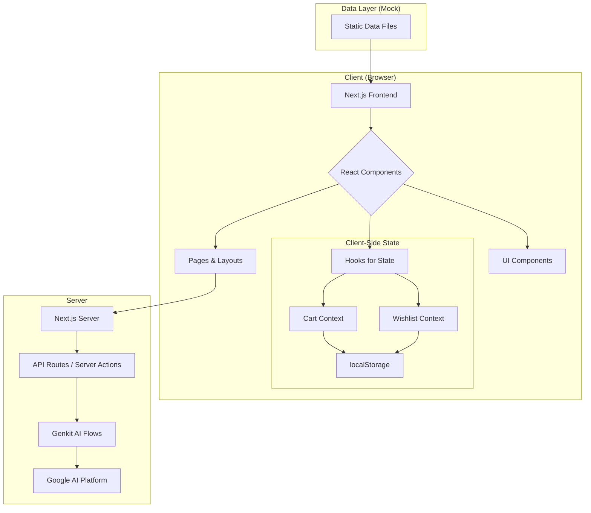

# 📖 BookBrew: Discover Your Next Chapter

Welcome to BookBrew, a feature-rich e-commerce application for an online bookstore. This application is built with Next.js and demonstrates a complete user-facing storefront, a comprehensive admin dashboard, and integration with Generative AI for personalized experiences.

## Key Features

- **Dynamic Storefront**: Browse and search a catalog of books.
- **Advanced Filtering**: Filter books by genre, author, price, and rating.
- **Shopping Cart & Wishlist**: Persistent cart and wishlist functionality using client-side storage.
- **User Profiles**: View order history and manage a personal wishlist.
- **Admin Dashboard**: A secure area to manage products, orders, and customers.
- **Sales Analytics**: Visual charts for tracking revenue and sales performance.
- **AI-Powered Recommendations**: Personalized book suggestions based on user behavior.
- **Responsive Design**: A seamless experience across desktop and mobile devices.

## Tech Stack

- **Framework**: Next.js (with App Router)
- **Language**: TypeScript
- **UI**: React, Tailwind CSS
- **Component Library**: ShadCN UI
- **Generative AI**: Google's Genkit
- **Icons**: Lucide React
- **Charts**: Recharts

## Application Architecture

The application is divided into two main parts: the public-facing storefront and the admin dashboard. State management for the cart and wishlist is handled on the client-side using React Context and `localStorage`, while the core business logic and data are simulated in the `src/lib/data.ts` file.



## Core Functionality in Detail

### 1. User-Facing Application

This is the e-commerce storefront accessible to all users.

-   **Homepage**: The landing page features a prominent hero section, a curated list of "Featured Books," and a "Personalized For You" section driven by our Genkit AI flow.
-   **Book Listings & Filtering (`/books`)**:
    -   **Logic**: This page displays all available books with pagination. The core logic resides in `src/app/books/page.tsx`.
    -   **Filtering**: The `BookFilters` component maintains a `filterState` (search term, genre, author, price, rating). When "Apply Filters" is clicked, this state is passed up to the main page, which then re-calculates the `filteredBooks` using `useMemo` for performance.
-   **Shopping Cart & Wishlist**:
    -   **Logic**: The `useCart` and `useWishlist` hooks (`src/hooks/`) provide global state management for these features.
    -   **Persistence**: `useEffect` is used within the providers to read from and write to the browser's `localStorage`. This ensures that a user's cart and wishlist are saved even if they close the browser tab.
-   **User Profile (`/profile`)**: This page uses a tabbed interface to show the user's `wishlistItems` (from the `useWishlist` hook) and their `orders` (from mock data).

### 2. Admin Dashboard (`/admin`)

A protected area for store administrators to manage the application's data.

-   **Dashboard Overview**: The main admin page (`/admin/page.tsx`) provides a snapshot of the store's performance.
    -   **Analytics Cards**: Key metrics (Total Revenue, Customers, Books Sold) are calculated dynamically from the mock data in `src/lib/data.ts`.
    -   **Sales Analytics Charts**: The `AnalyticsCharts` component (`src/components/admin/analytics-charts.tsx`) processes the `orders` array to aggregate revenue and sales volume per day, displaying the trends on both a line chart and a bar chart for easy comparison.
-   **Book Management (`/admin/books`)**:
    -   **Logic**: This page allows for full CRUD (Create, Read, Update, Delete) operations on the book catalog.
    -   **Data Table**: The `BooksDataTable` component is a reusable and interactive table built with `@tanstack/react-table`.
    -   **Actions**: The "Actions" column provides "View details," "Edit," and "Delete" functionality. These actions trigger dialogs (`AlertDialog` and `Dialog` from ShadCN) that contain respective components (`BookDetails`, `AddBookForm`) to perform the operations.
-   **Order & User Management**: Similar to Book Management, these sections use data tables to display and manage orders and users, allowing an admin to update order statuses or change user roles.

### 3. Generative AI with Genkit

The application leverages Genkit to provide intelligent features.

-   **Personalized Recommendations**:
    -   **Flow**: The logic is defined in `src/ai/flows/personalized-book-recommendations.ts`.
    -   **How it Works**:
        1.  The `BookRecommendations` component on the homepage calls the `getPersonalizedBookRecommendations` server action.
        2.  This action invokes a Genkit flow, passing the user's (currently mocked) browsing history, purchase history, and wishlist.
        3.  A prompt is sent to the Google AI model, instructing it to act as a book expert and recommend new titles based on the provided history. The prompt specifically asks the AI to avoid recommending books the user has already seen.
        4.  The AI returns a list of recommended book titles.
        5.  The component then finds these books in the main `books` data and displays them in a carousel. A fallback mechanism ensures that if the AI fails or returns too few results, the section is populated with other popular books.
```
